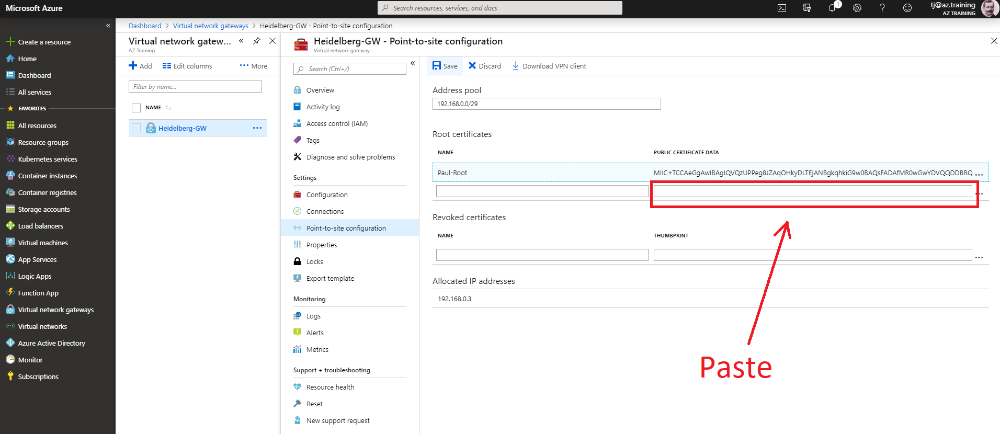

## Self signed certificates for Point-to-Site VPN

A name, e.g. Paul
<details>
 ```powershell
 $Name = "Paul"

$RootCertName   = $Name + "-RootCertificate"
$ClientCertName = $Name + "-ClientCertificate"
```
</details>

Generate new Root certificate 

```powershell
$RootCert = New-SelfSignedCertificate `
              -Subject   "CN=$RootCertName" `
              -FriendlyName  $RootCertName `
              -CertStoreLocation 'Cert:\CurrentUser\My' `
              -Type Custom `
              -KeySpec Signature `
              -KeyExportPolicy Exportable `
              -HashAlgorithm sha256 `
              -KeyLength 2048 `
              -KeyUsageProperty Sign `
              -KeyUsage CertSign
```

Generate new Client certificate signed by Root Certificate

```powershell
New-SelfSignedCertificate `
  -Subject  "CN=$ClientCertName" `
  -FriendlyName $ClientCertName `
  -CertStoreLocation 'Cert:\CurrentUser\My' `
  -Type Custom `
  -KeySpec Signature `
  -KeyExportPolicy Exportable `
  -HashAlgorithm sha256 `
  -KeyLength 2048 `
  -Signer $RootCert `
  -TextExtension @("2.5.29.37={text}1.3.6.1.5.5.7.3.2")
```

List all personal certificates

```powershell
Get-ChildItem Cert:\CurrentUser\My | sort Subject
```

Copy Root Certificate into Clipboard

```powershell
[System.Convert]::ToBase64String($rootCert.RawData) | clip
```

Paste it into Azure Portal!


